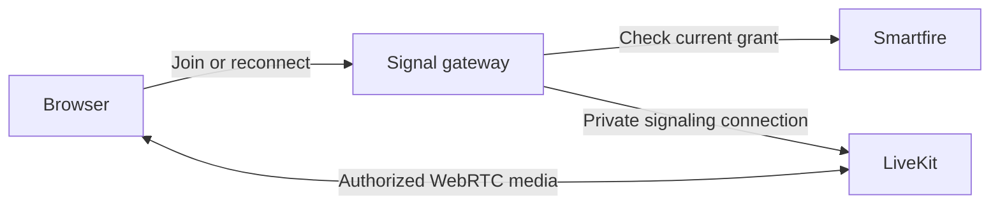

# Huddle authorization boundary

The browser's LiveKit token is necessary but is not sufficient to enter a huddle. Smartfire's current authorization record must also allow the connection. This covers both the original join token and tokens refreshed by LiveKit.

## Connection path

The public gateway accepts only the supported LiveKit signaling and validation routes. LiveKit's raw signaling and administration endpoint must remain private. An exposed raw endpoint bypasses the gateway and invalidates this security boundary. WebRTC media ports have a separate purpose and retain their normal network configuration.

The gateway checks authorization before contacting LiveKit. It holds the first upstream signal, checks authorization again, and only then exposes the connection to the browser. This second check covers a grant revoked while the upstream join was being established.

Each admitted grant is checked against Smartfire's current state once per second, including after its signaling socket disappears. A denied or failed check closes signaling and requests `RemoveParticipant` against LiveKit's private API. Closing a WebSocket by itself is insufficient evidence that audio or video has stopped.

A dropped signaling socket gets a three-second reconnect grace period. A valid replacement connection cancels that pending cleanup. If removal has already started, admission waits for it to complete; an uncertain removal cannot race a newly admitted connection with the same identity.

## Authorization records

Each grant binds a random, unique participant identity to a specific Smartfire session, user, membership, and room. Authorization checks validate those current database relationships, including active human status. The signed token's identity and room must match the grant. An expired token cannot initiate a connection, but expiry of the initial token does not terminate an otherwise authorized active call.

Revoked grants are never reactivated. If membership is later granted again, a new authorization receives a new participant identity. Previously captured tokens remain denied even though the user can join with the new authorization.

Group direct messages use the same records: a grant is issued only to a current room member, so a non-member's join is denied the same way, and removing a member revokes their grants immediately, exactly as channel removal does. Ringing every other member is a notification fan-out on top of those records, not a separate authorization; see [group DMs](group-dms.md).

Revocation and its pending cleanup request are persisted in the same database transaction. Queue delivery is an optimization; reconciliation must recover pending cleanup after an enqueue failure, worker restart, or LiveKit outage. Cleanup is idempotent and never targets an unrelated grant.

## Failures and guarantees

- Authorization errors, timeouts, and unexpected responses deny new connections. Successful decisions are not cached.
- Active calls depend on authorization checks remaining available. A backend outage ends them rather than silently extending authorization.
- A gateway must be supervised together with its LiveKit server. If the gateway exits, the supervisor stops that server so media cannot continue without enforcement. Restarting the pair interrupts calls.
- Revocation is not instantaneous across processes and networks. The default check interval is one second and each request has a 1.5-second deadline. Failed participant removal retries for up to ten seconds, then the gateway exits with failure. The local supervisor sends termination to LiveKit and forces termination after five seconds. These are configured bounds on a responsive host, not a measured internet-wide latency promise.
- Database cleanup records survive process restarts. The reconciler checks due work every five seconds and persists retries with increasing delays up to fifteen minutes. This recovery path complements the gateway's immediate removal and shutdown behavior.
- Closing a call in the browser, hiding a control, relying on token expiry, or receiving a webhook after a participant joins is not the admission boundary.
- All supported signaling paths must stay behind the gate after upgrades. Direct server administration is private and uses separate service credentials.

## Verification requirements

The implementation is ready only after the following behavior has been checked:

| Scenario | Required result |
| --- | --- |
| Valid current member joins and reconnects | Audio/video transport continues through the gateway |
| Original token replayed after membership removal | Connection denied before the public WebSocket opens |
| LiveKit-refreshed token replayed after removal | Same denial |
| Removed membership is granted again | New identity can join; old identities remain denied |
| Session ends while another user remains in the huddle | Targeted media ends; the other participant stays connected |
| Revocation occurs while an upstream join is pending | No upstream signal is exposed to the revoked browser |
| Authorization backend fails | New joins are denied; active removal is requested |
| Signaling disappears while media may still flow | Grant checks continue; reconnect grace ends in participant removal |
| LiveKit's removal API remains unavailable | Gateway fails and its supervisor stops LiveKit |
| Cleanup queue or LiveKit fails | Durable pending work survives and is retried |
| Request contains conflicting credentials or an unsupported path | Request rejected without forwarding |
| Raw signaling port is addressed outside its private boundary | Connection unavailable |
| Gateway process exits | Its supervised LiveKit server also stops |

Gateway tests exercise controlled connection races and failure handling. Browser tests use the real LiveKit server and synthetic media. Deployment checks must separately verify the actual public/private network boundary; same-machine browser tests cannot prove a cloud firewall configuration.

## Local verification, September 14, 2026

- Gateway: 13 tests passed, including pending-join revocation, backend failure, dropped signaling, reconnect cleanup races, and the removal deadline.
- Browser suite: all 16 tests and 238 assertions passed. A browser that ignored its access polls still lost media after grant revocation, while the other participant remained connected. Original and real server-refreshed tokens were denied after revocation and after membership restoration; a valid refreshed-token reconnect received audio on a new peer connection.
- Application suite: 441 tests and 1,424 assertions completed without failures or errors; two existing image-operation tests were skipped. The subsequent bounded-conflict regression passed in a focused four-test run.
- Ruby lint and the security scanner passed. Production assets compiled, and the huddle controllers, stylesheet, and bundled LiveKit client were present in the generated manifest.
- Forced gateway process failure stopped all three supervised children and closed raw signaling, gateway, and UDP media ports in 4.47 seconds in this local check. This observation does not replace the configured failure bounds above.
- GCP deployment, public firewall rules, external TLS/TURN connectivity, and production container execution remain unverified by these local checks.

See [local operation](huddles.md), LiveKit's [token lifecycle](https://docs.livekit.io/frontends/reference/tokens-grants/#self-hosted-deployments), and its [ports and firewall reference](https://docs.livekit.io/transport/self-hosting/ports-firewall/).
